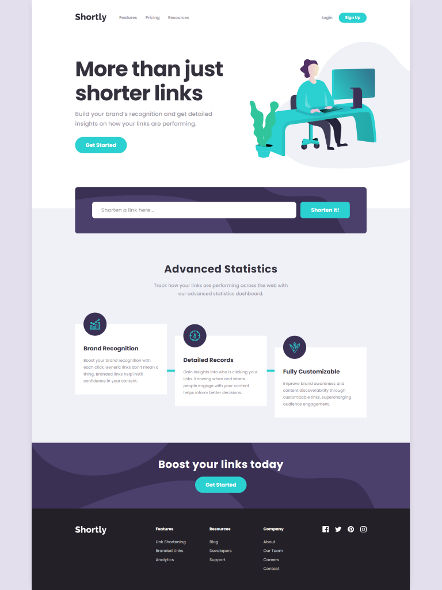

# Frontend Mentor - Shortly URL shortening API Challenge solution

This is a solution to the [Shortly URL shortening API Challenge challenge on Frontend Mentor](https://www.frontendmentor.io/challenges/url-shortening-api-landing-page-2ce3ob-G). Frontend Mentor challenges help you improve your coding skills by building realistic projects.

## Table of contents

- [Overview](#overview)
  - [The challenge](#the-challenge)
  - [Screenshot](#screenshot)
  - [Links](#links)
- [My process](#my-process)
  - [Built with](#built-with)
  - [What I learned](#what-i-learned)
  - [Continued development](#continued-development)
- [Author](#author)

## Overview

### The challenge

Users should be able to:

- View the optimal layout for the site depending on their device's screen size
- Shorten any valid URL. Used TinyURL API which has a limit of 100 links (free tier)
- See a list of their shortened links, even after refreshing the browser
- Copy the shortened link to their clipboard in a single click
- Receive an error message when the `form` is submitted if:
  - The `input` field is empty

### Screenshot

### Links

- Solution URL: [Solution](https://github.com/socratesioa/url-shortening-api)
- Live Site URL: [Live Site](https://url2912.netlify.app/)

## My process

### Built with

- Semantic HTML5 markup
- CSS custom properties
- Flexbox
- CSS Grid
- Mobile-first workflow
- JavaScript
- Netlify functions
- TinyURL API
- Sass/SCSS

### What I learned

The landing page design was very clean and I didn't have many issues coding it. I tried using the API suggested but I noticed it was on several occasions redirecting to some strange and questionable sites. So I opted to use the TinyURL API which is much more reliable. In this challenge I got the chance to practice integrating the API along with JS form validation and rendering the results. I had to use Netlify to store the API key which was a good experience as I've only used it a few times at this point.

### Continued development

In encountering the issue with the suggested API, it's now in my near future plans to attempt to create my own url shortening api. That will be a very useful challenge.

## Author

- Website - [My Portfolio](https://portfolio.thisissocrates.com/)
- Frontend Mentor - [@socratesioa](https://www.frontendmentor.io/profile/socratesioa)
